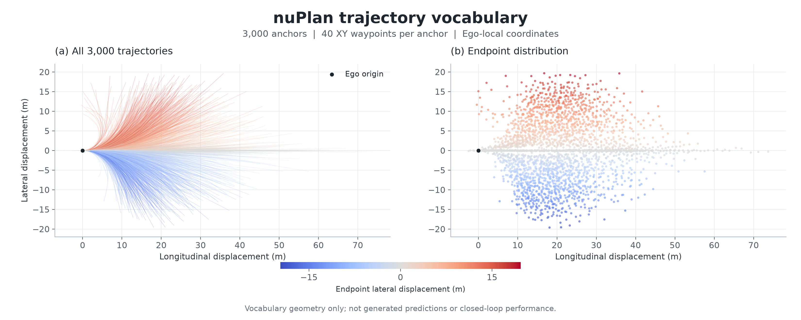

# DriveAnchor: Anonymous Evaluation and Implementation Release

This anonymous review release contains the evaluation configuration, per-scenario
records for the reported public nuPlan runs, planner/model implementation
snapshots, score-head training and ablation code, checkpoint identifiers, and
file-verification metadata for DriveAnchor. It contains no author Git history,
raw driving logs, personal identifiers, or non-anonymous download links.

## Contents

| Directory | Contents |
| --- | --- |
| `evaluation/config/` | Planner configuration used by the public evaluation release |
| `evaluation/results/` | Per-scenario records for the sampled Val14 and Test14-hard runs |
| `code/model/` | FM/EF model implementation snapshots |
| `code/runtime/` | Planner, feature, selection, and evaluation runtime snapshots |
| `code/evaluation_sources/` | nuPlan evaluation adapters and runners |
| `code/scorehead/` | Score-head implementation, training/ablation scripts, and archived patches |
| `code/dependencies/` | Supporting planner and model modules |
| `weights/` | SHA-256 and byte-size identifiers for the original checkpoint objects |
| `assets/vocabulary/` | 3,000-anchor visualization and source/image checksum metadata |

## Evaluation Scope

The evaluation directory contains the planner configuration, the original
per-scenario JSON records, and identifiers for the two checkpoint objects used
by the release. The source directories are provided for implementation
inspection and for adapting the evaluation path to a compatible environment.
They are not claimed to be the exact, end-to-end source tree that generated
every internal result in the paper.

The runtime files include historical implementation snapshots. Some scripts
refer to deployment-specific paths or external modules; replace those paths
with local configuration before execution. The score-head top-1 route and the
legacy selector are separate execution paths. Do not apply archived patches to
an unrelated installation.

The result JSON files are retained without numerical changes. Packaging and
anonymization do not constitute an independent validation of the sampling
provenance or of every diagnostic field in those records.

nuPlan data and maps, the nuPlan devkit, compatible CUDA/PyTorch dependencies,
and the checkpoint binaries are external requirements. This release is not a
standalone, one-command reproduction package for all three training stages,
all internal experiments, or complete closed-loop evaluation. No new training
or closed-loop evaluation was performed to create this snapshot.

## Training Code Scope

The release includes score-head training and ablation scripts under
`code/scorehead/`. These scripts are implementation references and require the
corresponding feature records, vocabulary, pretrained model context, and
environment used by the original experiments. They do not constitute a
complete release of the Stage 1 FM pretraining, Stage 2 EF/FM post-training,
and Stage 3 reward-fine-tuning data and infrastructure.

## Checkpoints

The files under `weights/` are Git LFS pointer records containing the expected
object SHA-256 values and byte sizes for `model_08000.pt` and `fag_best.pt`.
They are identifiers, not loadable checkpoint binaries. No non-anonymous URL is
embedded in this release.

## nuPlan Vocabulary

The released model/runtime snapshots use 3,000 anchors with 40 XY waypoints
per anchor (array shape `(3000, 40, 2)`). The standalone vocabulary array is
not included; the image below is a visualization of the vocabulary geometry,
not generated predictions or closed-loop performance.



Source-array and image SHA-256 hashes are recorded in
`assets/vocabulary/summary.json`.

## File Verification

```bash
python3 verify.py
```

`MANIFEST.json` records the hashes of the packaged files. Existing third-party
attribution remains applicable; see `NOTICE.md`.
